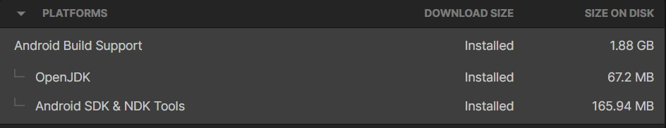
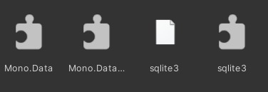
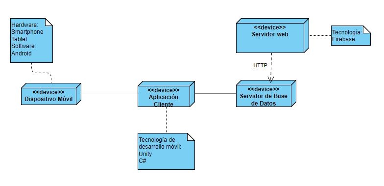
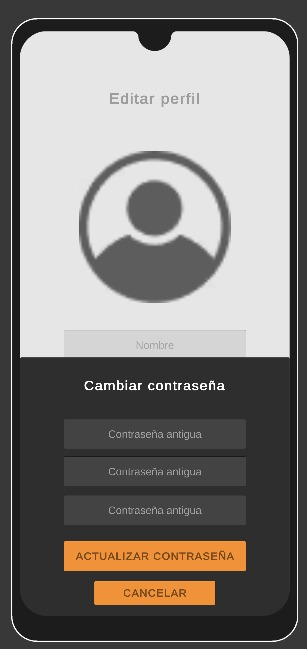
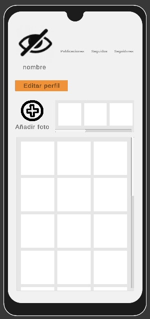

# Asignación 4 - Grupo 4
## Integrantes
---
+ Junior Huaman Rojas
+ Jesus Pisconte Rios
+ Graciela Cruz Trinidad


## <center>Entorno de Desarrollo
</center>

---

## Configuración del Ambiente de Desarrollo


<div style="text-align: justify">
Como parte de la elaboración de este proyecto se hará uso de Unity como ambiente de desarollo. Unity es un motor gráfico multiplataforma 2D y 3D el cual permite desarrollar videojuegos. Para este proyecto nos enfocaremos en el desarrollo de una aplicación móvil en Android.
</div>

Para ello serán necesarios los siguientes softwares:

+ Unity Hub
+ Unity Editor (Versión de preferencia)
+ Visual Studio
+ SDK 


## Instalaciones de Software

### Instalacion de Unity 
1) Instalar Unity Hub desde su [sitio oficial](https://unity.com/unity-hub) 

2) Instalar Unity Versión 2021.3.18f1 desde este [link](https://unity.com/releases/editor/whats-new/2021.3.18)

### Instalacion de Visual Studio Community 2019
  1) Instalar Visual Studio Community 2019 desde su [sitio oficial](https://visualstudio.microsoft.com/es/free-developer-offers/) 

## Conexión con la base de datos

Para conectar con la base de datos, se abre una nueva conexion haciendo uso de una estructura como esta:
```gradle

using (IDbConnection dbconn = new SqliteConnection(conn))
{
     dbconn.Open(); //Abrir conexion con la base de datos.
     dbcmd = dbconn.CreateCommand();
     //Se escribe el query o los querys que se requieren en una variable de tipo String
     dbcmd.CommandText = sqlQuery;
     dbcmd.ExecuteScalar(); //Se ejecuta el query
     dbconn.Close(); //Cerrar conexion con la base de datos
}


```

## Instalación de SDK de Android y Firebase

Se puede descargar el SDK de Android en el siguiente enlace: [SDK Android](https://developer.android.com/studio) 


Estas son las librerias que se utilizarán:



Se puede descargar el SDK de Firebase y seguir los pasos de instalación en el siguiente link:
 [SDK Firebase](https://firebase.google.com/docs/unity/setup?hl=es-419) 


Se debe agregar el siguiente código al inicio de la aplicación.
```gradle
Firebase.FirebaseApp.CheckAndFixDependenciesAsync().ContinueWith(task => {
  var dependencyStatus = task.Result;
  if (dependencyStatus == Firebase.DependencyStatus.Available) {
    // Create and hold a reference to your FirebaseApp,
    // where app is a Firebase.FirebaseApp property of your application class.
       app = Firebase.FirebaseApp.DefaultInstance;

    // Set a flag here to indicate whether Firebase is ready to use by your app.
  } else {
    UnityEngine.Debug.LogError(System.String.Format(
      "Could not resolve all Firebase dependencies: {0}", dependencyStatus));
    // Firebase Unity SDK is not safe to use here.
  }
});
```
## <center>Diagrama de Despliegue</center>

---


## <center>Requerimientos No Funcionales
</center>

---
Los requerimientos No Funcionales del presente proyecto son los siguientes: 

+ Seguridad: 
<div style="text-align: justify">
La aplicación deberá contar con ciertas medidas de seguridad con el fin de proteger la información de los clientes y así ser efectivos en el servicio. Es decir, deberá realizarse cierta identificación del usuario al iniciar sesión mediante conexiones a servicios web como Firebase.
</div>

+ Escalabilidad: 
<div style="text-align: justify">
 Se tendrá que tomar en cuenta la posibilidad de aumento de usuarios en el sistema y preparar
correctamente a la base de datos para esa situación, ya que no se desea bajar el rendimiento de la aplicación.
</div>

+ Compatibilidad: 
<div style="text-align: justify">
La aplicación debe estar disponible solamente para Android y además adecuarse correctamente a los pixeles de 
cada dispositivo móvil, de manera que se ofrezca la mejor experiencia posible al cliente.
</div>

+ Mantenimiento: 
<div style="text-align: justify">
 Se tendrán que realizar optimizaciones continuas con el fin de brindar un mejor servicio; asismismo, realizar la corrección de cualquier error
que se presente en la aplicación.
</div>


## <center>Diagrama de Caso de Uso
</center>

---
En esta sección se ha diagramado los casos de uso de nuestra aplicación y se muestran las siguientes funciones que pueden realizar.


## <center>Descripción de Casos de Uso
</center>

---
1. Logearse a la aplicación:
Entrar al sistemas mediante la verificación del usuario y contraseña.
<center>

</center>
2. Crear una cuenta:
El usuario brindará al sistema datos del usuario como su nickname, correo, contraseña.
<center>

</center>
3. Editar Perfil:
El usuario accederá a la opción de edición de sus datos como su nombre, usuario o correo.
<center>

</center>
4. Actualizar Contraseña:
El usuario podrá cambiar su contraseña por una más reciente verificándose primero su anterior contraseña.
<center>

</center>
5. Recuperar Contraseña:
El usuario colocará su correo en el sistema y recibirá un mensaje de confirmación sobre la reucperación de su contraseña
<center>

</center>

6. Ver Perfil de Otros Usuarios:
El usario podrá ver los perfiles de sus seguidores como de seguidos.
<center>

</center>

7. Crear Historia Destacada:
El usuario podrá subir sus publicaciones como historias destacadas.
<center>

</center>


---
### Fuentes:
+ https://developer.android.com/studio
+ https://docs.unity3d.com/Manual/index.html
+ https://firebase.google.com/docs/unity/setup?hl=es-419
